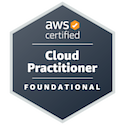
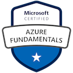
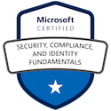
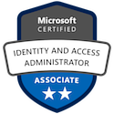

### Hi there, my name is Ladcze 👋
#Linux #Gamer #United;

---

### About moi
#### I'm an Accounting major turned IT Pro, and an avid learner!

- 🔭 I currently manage all ICT services to the business while playing a lead role in the delivery of a variety of IT related projects.
- 🌱 Every day is a school day: I am always learning to further improve my technical skills and keep abreast of changes within the information technology landscape <!-- Check https://www.indeed.com/career-advice/career-development/keeping-up-with-technology -->
- 👯 I look to collaborate with organizations and individuals to solve business problems leveraging on data management while adhering to generally accepted best practices and standards. 

---

#### Languages & Tools
- SQL, Python, Bash. 
- VS Code / Azure Data Studio / SSMS

--- 

#### Core Skills 
- Cloud services:  Cloud Computing / Cloud Networking / Cloud Security / Cloud Storage / Virtualization (Pry - Azure, Sec - AWS).
- Secuirty: Azure AD / Compliance Management / Identity And Access Management / Information Protection And Governance / Security Management
- Data management: Database Administration & Manipulation / Data Storage / Azure Data / Azure Data Analyst / Azure DBA / Azure SQL Database / 
  Cloud Data Services / Data Analytics / Data Visualization / Power BI / SQL Server On Azure Virtual Machines.
- Business Analysis: Requirements gathering / Analytical & Critical Thinking / stakeholder management / Cost-Benefit Analysis / SQL Databases / Microsoft Excel / Use-case Modelling / Documentation and Presentation.
<!-- AI/ML: Azure Bot Services / Azure Machine Learning. -->

---

#### Pro memberships & Certifications
- BCS, The Chartered Institute for IT: Professional member (MBCS). Membership no: 990251404.
- RIIT: Professional Registration of IT Technician (RITTech). Registration no: RITTECH003559
- Association of Certified Chartered Accountants (ACCA) Part qualified. Reg. no: 1388675. 
<!--                     -->
- Amazon Web Services Cloud Practitioner. Credential ID 2444299.
- Microsoft Cerified: AZ/DP/AI/PL/MS-900.
- Microsoft Certfied: Azure Administrator Associate. Credential ID ACEEFF5F09E1F4D1.
- Microsoft Certfied: Identity Access Management Associate. Credential ID 729974917D98E12C.
- Microsoft Certified: Security, Compliance & Identiry. Credential ID 42EC67E208FFEA05.
- AXELOS Global Best Practice: PRINCE2. Credential ID 2000045422.

<!---->
<!---->
  
<!--
- Microsoft Certified: AZ/DP/AI/PL/MS-900s.
- Microsoft: Security Operations Analyst.
- Microsoft: Azure Database Administrator Associate. 
- Microsoft: Power BI Data Analyst Associate. 
-->

---

#### 📕 Blog Posts
Watch this space 😄

---

####  😄 Fun facts/Personal Interests
- A peek into the other Ladcze you may have not met yet...  
⚡ Actor / Puppeteer / Radio-show Host (Sunday Gist) / MC/Compère.   
⚡ Fun fact 1: I enjoy gaming (FIFA series, Arkham Series, Tomb Raider series, a bit of CoD & more), music and movies.  
⚡ Fun fact 2: Watch football, play basketball.  
✨ calledToShowTheLoveOfChrist

---

#### 💬 Connect with me
<!-- 
[Twitter logo]@orimsway2cool
https://twitter.com/orimsway2cool | https://uk.linkedin.com/
@orimsway2cool 
-->

                   
<!--                     -->

<!--
[][twitter]
[][linkedin]
-->

---

#### 👯 Github Stats:

  
<!-- 
Alternate Github stats code: 

-->

<!--#Widget to show most used programming language# -->

<!--

-->  

---

<!--
**Ladcze/Ladcze** is a ✨ _special_ ✨ repository because its `README.md` (this file) appears on your GitHub profile.
Here are some ideas to get you started:
- 🔭 I’m currently working on ...
- 🌱 I’m currently learning ...
- 👯 I’m looking to collaborate on ...
- 🤔 I’m looking for help with ...
- 💬 Ask me about ...
- 📫 How to reach me: ...
- 😄 Pronouns: ...
- ⚡ Fun fact: ...
-->
